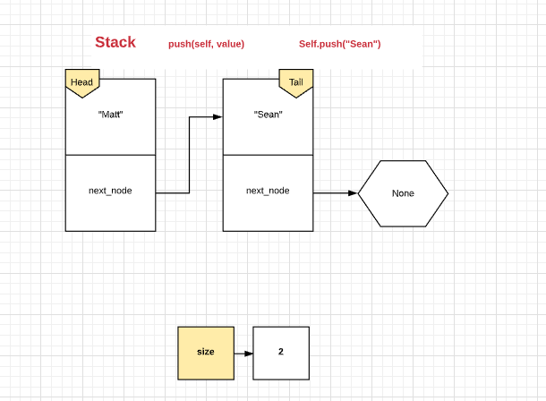

# Data Structures Day 2 Notes

### Singly Linked Lists Review

1. When we initialize a node, we can pass in the value and we can pass in the next node. 

    * When we initialize a new node, the head has the value but because it's the only node, the tail is None. Next node points to None. 

2. If we want to get the value of a node, when we call `.get_value(self)`, we return self's value. If we called get value on our singular node, it would return just the information in the head. It references the instance of the class Node.  It would not return the entire node because in our Node class, the get_value function says to  `return self.value`, not just `return self`.

3. When we call `.get_next(self)`, the next node - the pointer - would be called. At this point, there is no value in the next node, meaning it would return None.

4. If we run the `set_next(self, new_next)` function and passed in the the value "my_new_node", it changes the next_node value of None on the original node. Instead of None, it point to the _whole_ new node ("my_new_node") - pointing to both the value and the next_node within the Node. 
 
  

    
  

5. As far as the data that the class LinkedList stores, it's a head variable that points to a node and a tail variable that points to a node. If we initialize a linked list, all that's going to happen at the beginning is we're going to have a head _and_ tail on None. That's all that happens when we initialize a linked list. 

6. If we have an empty linked list and we want to add something to the tail, we have our `add_to_tail(self, value)` where we accept a _value_. We are **not** passing in a node; we're passing in a value. The add to tail method is responsible for creating the node. When we call `LinkedList.add_to_tail("Matt")`, we're passing in the value of "Matt."

    * The first thing that happens it that we've got a brand new node that gets created with the value of "Matt" and the next node gets a pointer to None. 

    * The logic here is if we have an empty LL, someone wants to add something to the tail but it actually needs to be added to both the head and the tail. So the value "Matt" is actually the head and the tail. At the end of adding to tail if the thing is blank, the next node points to None while the whole node of "Matt" has both the head and the tail. This is our whole linked list.

     
    

      
    

7. Let's add another thing to tail. We're going to pass in the value - a string - "Sean." Like before, the next node is None again. Then, we're going to reference it, called new_node, that is going to point to the whole node (the value and the pointer).

    * If we check for a head, we see that it does have one. The head is pointing to the "Matt" node. Ditto for tail. Now, if we do `self.head`, it will return the Matt node. 

    * Since the if statement is checking for a falsy value but receives truthy, we will go into the else statement. It references the `self.tail` that's in the Matt node. We call the `.set_next()` method to it. The set next method comes from the Node class b/c the tail is a reference to the Matt node. Set next expects an _entire_ node. 

    * Now what does our LL have? Remember, the LL's actual data that's being stored is just these two variables, head and tail.
    
     
    

      
    

8. When we call LL's remove head method, the linked list's reference is the head and tail. 

    * The remove head method will first check to see if there is a head available at all. If there isn't one, there's nothing else for the remove head method to do here. 

    * The next thing the method does is to see if there is just a single element with the `.get_next()` method. 

    * Finally, it checks for the value of the head that we want to remove and return the value of "Matt." It is _not_ the node, just the string "Matt."

    * When you delete the current head from the _linked list_, head will now point to the "Sean" node. 

    * The "Matt" node still exists in memory but it is no longer a part of the linked list with the "Sean" node. The "Matt" node still points to the "Sean" node - it's just that the LL no longer has a reference to it.

    * Eventually, Python will see that nothing is actually referencing the "Matt" node and decide to clean it up for us (garbage collection). 

     
    

      
    

9. In our example of a Linked List, we have 2 items in it. We're going to remove the tail. 

    * In this method, we will make sure that there's a head (otherwise there's no point in going through the rest of the block of code).

    * The if statement is checking to see if this is a single item linked list. 

    * The `current` is pointing to the head node. 

    * While the current head does not also contain the tail, move the current to the next node until it finds the tail. It "walks" us down the list until we get to the tail. The reason we had to walk current down and get it to the one _before_ tail, is because once we remove the tail, we have to reassign it to whatever the current is. Current was the one before the original tail. 

    * Once we find the tail, we are done with the while loop. 

    * Current is assigned to self.tail (now it's "Sean" instead fo "Beej"). Once that's done, we won't need current anymore. We're going to return the value of "Beej"

    * The "Sean" node is still referencing the "Beej" node and we don't want that anymore. We need to set the tail to None. We fix that by calling `self.tail.set_next` and passing in None as a parameter.

    * "Sean" is no longer referencing "Beej" and it's tail is now saying None. The "Beej" node is still in memory but it is no longer chained in our linked list. As far as the linked list is concerned, we can forget about "Beej."

    * Finally, we can go ahead and return the new value - "Sean."

     
    

      
    

### Stacks

We start with a node. The node underlies Linked Lists' structure. Linked Lists underlies the Stack's structure. We're kind of constructing this building where each floor on top relies on the floor below it. Even though we have this thing called Stack, is really just some methods and the size variable that allow us to interact with a LL in a certain way 

1. Initialization of a Stack

    * When we initialize a new stack, we set the storage attribute that's on that stack to be equal to _empty_ linked list. 

        * An empty linked list is a head and a tail that are both set to None when it first starts out.

    * We're also keeping track of a size variable. 

     
    

      
    

2. Now, if we push something with the push method, we pass in a value. We call `add_to_tail` on our Linked List. 

    * What happens when we add to tail? If we want to push the string "Matt" onto our stack, we must first create the new node. In the add_to_tail method, we have our empty linked list which underlies the stack so our stack is empty and so is our linked list. 

    * We'll point both the head and tail to the newly created node and it's currently set to None. 

    * The initialized Stack where the head and the tail are both set to None no longer exists since the empty linked list and stack are now no longer empty.

    * The final step is incrementing the size from 0 to 1 due to the new node "Matt."

     
    

      
    

    * Let's add another node. We'll go through the same process we've described above for the singly linked list. We'll add to tail. 

        * So far, the only difference between our stack and our linked list is how we interact with it and the size variable. 

        * Now, "Sean" will be on the "top" of the stack. Remember how we consider stacks of papers? Well, the newest one added to the stack is on top.

        * Last In, First Out method

     
    

      
    

3. Linked lists work perfectly with stacks because all we need to do to have a stack with a linked list is a method to add to the tail and a way to remove the tail. All we ever do is either add to the top of the file (the tail) or remove from the top (by removing the tail).

    * With the `.pop` method, we return None if the size is already at 0. Otherwise, we decrement by 1 and return the new tail. 

### Queues

When initializing a queue with a linked list, it looks the same as when we initialized our stack. There a size variable and we have a linked list that we use for storage. 

We defined a len() method that if we try to find out the length of a queue, it will return the size variable.

1. **_Enqueue -_** When we enqueue an item, someone gets into the line (like a checkout line), what do we do? 
    
    * We add to tail. 
    
    * We have a size that starts out at 0 and if we initialize a queue, we also initialize a linked list.

    * Our linked list starts out with 2 Nones - 1 for head and 1 for tail.

    * Once the node is created, just like before, the head and tail are both on the same node and it's pointing to None. The size count is now 1. 

     
    

      
    

2. **_Dequeue -_** When we dequeue an items, something gets out of the line (like when you finished the checkout process). We just remove the head. Let's say we have 2 nodes in the linked list: Matt and Sean. 

    * We call that remove_head method on linked list. 

    * First In, First Out method

    * Just remember that when we dequeue something, we're going to return the head. 

    * We decrement the size by 1. 

    * Since we're removing the head of the linked list, the head pointer will get placed on the next node in the list. 

    * The "Matt" node will point to None and making no reference to the linked list. It will be trashed by Python. 

    * This leaves the "Sean" node to have the head and tail now since there are no other nodes in this linked list. 

     
    

      
    

### Doubly Linked Lists

Doubly linked lists require a different type of node than a singly linked list. Before, all we had was value and next. With doubly linked lists, we now have prev and then 2 pointers. 

1. Initialize New ListNode Class
    
    * We call ListNode and pass in the value, "Matt." 

    * Prev and Next point to None by default. This is a very similar logic to that of singly linked list classes. The only difference is that we now have a _pre-pointer_ that goes backwards on Prev. 

     
    

      
    

2. When using the method, insert_after(), we're referencing the "Matt" node. We will pass in the new value of "Sean."

    * The first thing we do is have current_next. Current_next points to self.next. Self is the "Matt" node. On self, next is None. So current_next is pointing to next's None value.

    * We then create a new ListNode with self.next. Next will no longer point to None anymore. Instead, it will point to a new ListNode. 

        * Now that we have the new value of "Sean" passed into the new ListNode. 

        * Since we have a previous ListNode, self is in reference to the "Matt" node. The prev pointer will point at "Matt."

        * The Matt node's next value will be set to the Sean node. And then the Sean node's next pointer will be set to None. The current_next will just go away. 

    * We now check to see if next is another node or if it is None. 
    
     
    

      
    
