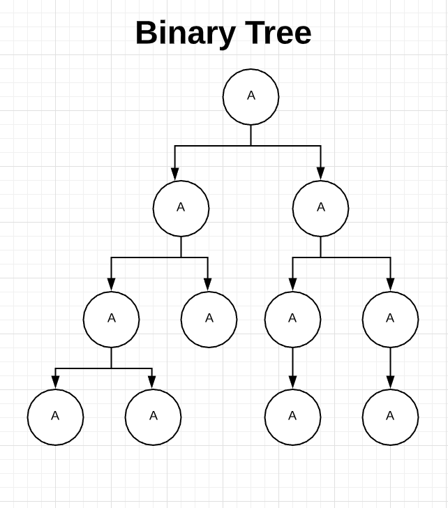
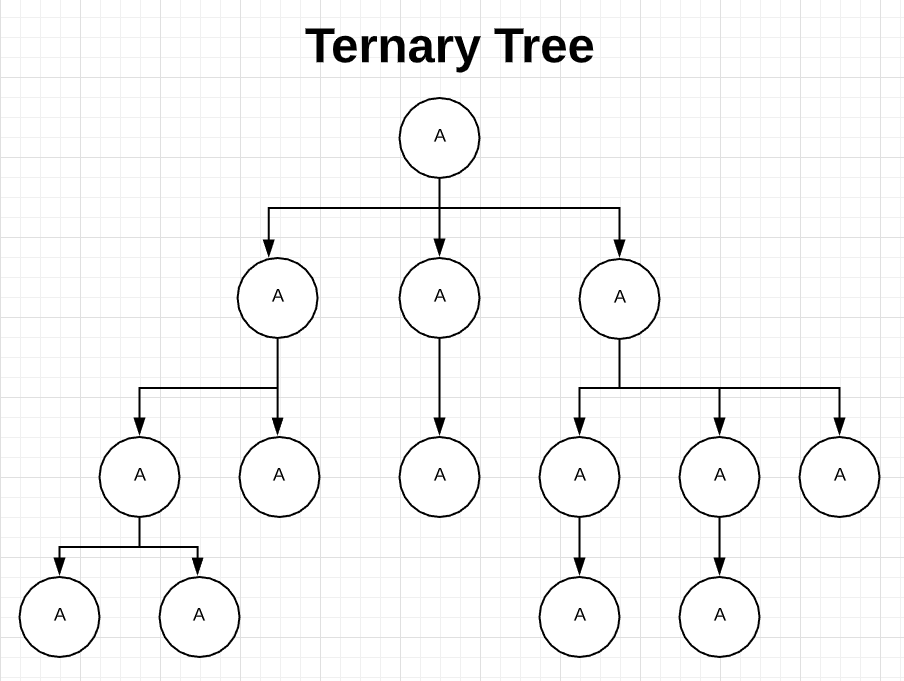
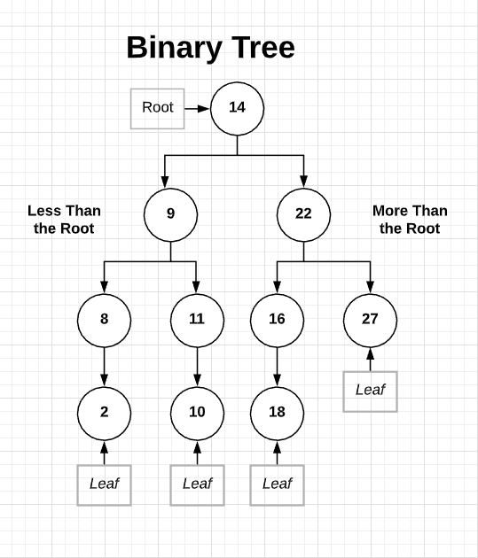
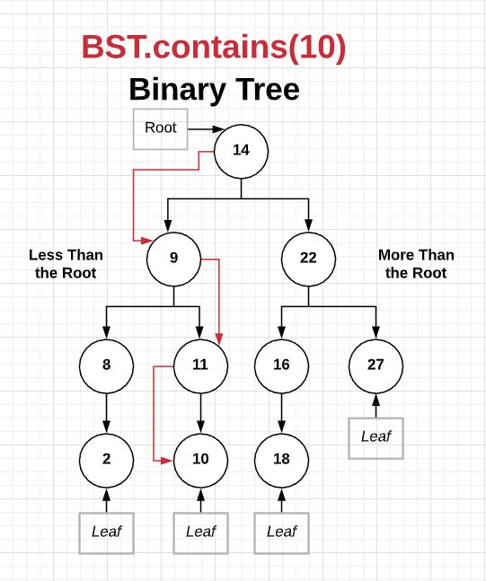
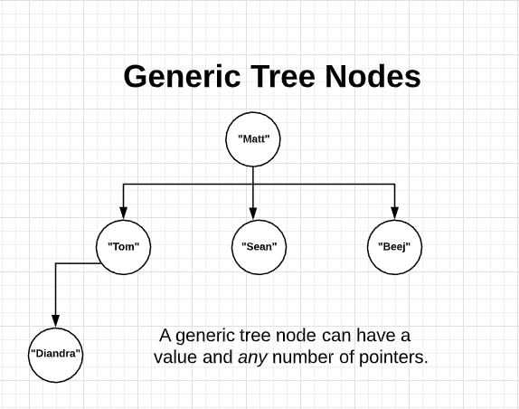
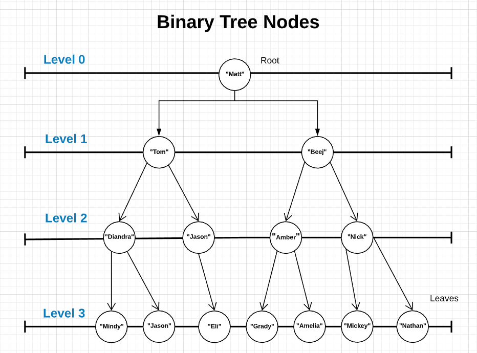

# Binary Trees

### Intro to Binary Search Trees

To understand how binary search trees work, we'll need to build up a conceptual mental model in our heads and then translate that model into working code.

Intuitively, trees can be thought of as linked lists, but without the constraint that each node only points to one other node. A tree can point to multiple other nodes in the tree.

Note that linked lists themselves count as trees. However, LL have the constraint that each node only points to a single other node. 

When we try to classify different types of trees, a very common classification is to talk about them in terms of the **_maximum number of nodes_** that a single node can point to. With a binary tree, every single tree node can point to _at most_ two other nodes. Hence, the name _Binary Tree_.

Binary trees are optimized for searching.

<br>
  <p align="center">
    
  </p>

With a Ternary Tree, a single node can point to at most, three nodes. A 4-ary Tree, can have a single node pointing at up to four nodes. This trend can go further. But you get the idea.

<br>
  <p align="center">
    
  </p>

1. Binary search trees are binary trees that maintain the following invariant:
    
    * For any given node, all values in the left subtree are less than the value at the given node.

    * Conversely, all values in the right subtree are greater than or equal to the value at the given node. 

    * The same is true further down the tree you go. 

    <br>
    <p align="center">
      
    </p>

2. Example of Binary Search Tree Class:

    ```
    class BinarySearchTree:
      self.value = value
      self.left = left_subtree
      self.right = right_subtree
    ```

3. If we wanted to do a contains check on our binary tree for the number 10, we would start at the root. Since 10 is less than 14, we would then look on the left subtree. Now, since 9 is less than 10, we need to look in 9's right side subtree. There, we see 11. Since 11 is greater than 10, we look in the left side to see if 10 is there. 

    <br>
    <p align="center">
      
    </p>

4. Questions to Ask Yourself:

    * How would inserting into a binary search tree work? How would it differ from the contains example above?

    * In the contains example, out of all the elements in the BST, how many did we actually check? How does this compare to the number of elements we would have to check if we were checking for a value in an array or a linked list?

    * Is inserting into a BST more or less work than inserting into an array or linked list? Why?

5. Pros and Cons of Binary Search Trees

    * Pro: Searching for an element in a BST is significantly more efficient that searching through an array or linked list. Why might this be the case?

    * Cons: 
    
      * As a tradeoff, it is not as efficient to insert into a BST. Why might this be the case?

      * The performance of a binary search tree depends quite a lot of whether the tree is "balanced" or not. Is this generally a good assumption to make? When might this assumption be incorrect? 

### Trees and Binary Trees

Instead of a node that had a head and tail like singly linked lists, or even instead of having a doubly linked list (with a head, next, and prev), we had a more general node? 

A _Generic_ TreeNode (not a binary tree) can have a value and any number of pointers. A root node can point to any other node. A generic TreeNode is a value and any number of pointers.

In a way, a linked list is just a really simple tree. 
    
  <br>
  <p align="center">
    
  </p>

1. Search Tree Terminology to reference different aspects/parts of trees

    * **Path:** Path refers to the sequence of nodes along the edges of a tree.

    * **Root:** The topmost node in the tree

    * **Child:** A node directly connected to another node when moving _away_ from the root node.

    * **Parent:** A node directly connected to another node when moving _towards_ the root node.

    * **Siblings:** Nodes that share the same parent are considered siblings.

    * **Leaf:** A node that does not have any children of its own.

    * **Subtree:** represents the descendants of a node.

    * **Visiting:** refers to checking the value of a node when control is on the node.

    * **Traversing:** passing through nodes in a _specific_ order. 

    * **Levels:** the level of a node represents the generation of a node. If the root node is at level 0, then its next child node is at level 1; its grandchild is at level 2, and so on. 

2. Rules of a binary tree:

    * A binary tree is a type of tree where every node has a maximum of two children.

    * Usually, the 2 children are called left and right.
    
    * A perfect tree is when every level is completely full.

    * That being said, you don't have to have a perfect tree. Some nodes may become leaves whereas others may only have 1 child node instead of 2. The most a parent node can have is 2.

3. Properties of a "Perfect" Tree:

    * Number of total nodes on each level doubles as we move down

    * Number of nodes on the last level is equal to the sum of all other nodes + 1

4. If we were to have an actual class for our node, it would have a value, a left, and a right. 

    * Remember on DLL's, prev and next create a chained structure. The primary difference between DLLs and a binary tree is that binary trees have a hierarchical structure where the nodes can move forwards or backwards. 
    
  <br>
  <p align="center">
    
  </p>

5. Rules for a Binary Search Tree:

  * For each node, all elements in the left subtree are less than or equal

  * For each node, all elements in the right subtree are greater than

  * Each of the subtrees must also obey this constraint

  * A binary tree is _not_ the same as a binary search tree so always watch out for wording.