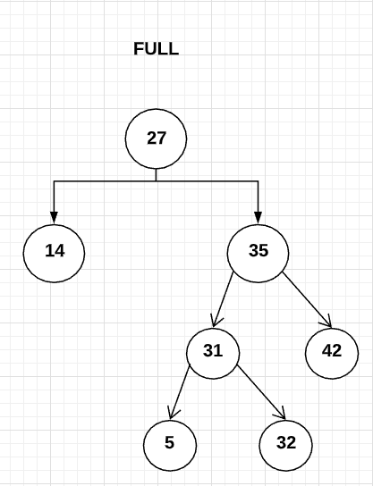
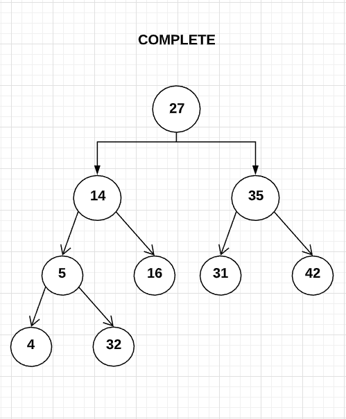
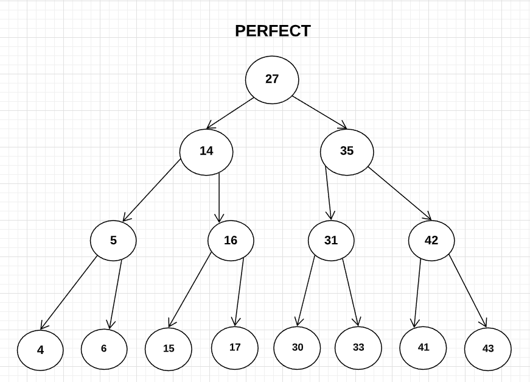

# Binary Tree Traversals

1. Three Kinds of Trees

    * Full Binary Tree

        * A tree where leaf nodes have no children

        * A tree that has 2 children - the leaves that do have children, they have 2. Both sides of a node must be complete. They cannot have 1 child. They MUST have 2. 

        * Every time we decide to have a descendant, we have to have 2 descendants. 

         
        

            
        

    * Complete Binary Tree == Binary Heaps

        * When we fill out the nodes, we go top to bottom and then left to right.

         
        

            
        

    * Perfect

        * All the leaves are on the same level.

        * All of the nodes that decide to have descendants have exactly 2 children.

        * A perfect binary tree is both complete and full. 

         
        

            
        

2. Three Fundamental Ways to Traverse a Binary Tree

    * Preorder Traversal - we visit the node, we visit the left subtree, and then the right subtree. `n l r`

        * _Before_ the left and right.

    * Inorder Traversal - left subtree, then the node, and then the right subtree. `l n r`

        * We visit the node _Inside_ the tree.

        * Binary Search Tree

    * Postorder Traversal - left subtree, right subtree, and then the node itself. `l r n`

        * We visit the node _after_ the left and right.

3. Think of recursion as the tasks we need to do at a node and the state stays on the call stack.